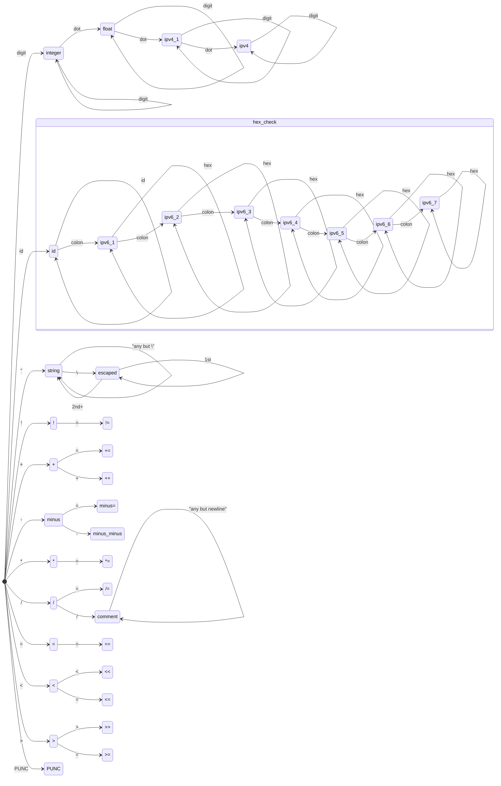

# My zig awesome project

## How to run

```shell
zig build run
```

## FSM diagram of lexical analyzer


```mermaid
stateDiagram-v2
    direction LR
    [*] --> integer :digit
    integer --> float :dot
    integer --> integer :digit
    float --> float :digit
    float --> ipv4_1 :dot
    ipv4_1 --> ipv4_1 :digit
    ipv4_1 --> ipv4 :dot
    ipv4 --> ipv4 :digit

    [*] --> id :id
    id --> id :id
    state hex_check {
        id --> ipv6_1 :colon
        ipv6_1 --> ipv6_1 :hex
        ipv6_1 --> ipv6_2 :colon
        ipv6_2 --> ipv6_2 :hex
        ipv6_2 --> ipv6_3 :colon
        ipv6_3 --> ipv6_3 :hex
        ipv6_3 --> ipv6_4 :colon
        ipv6_4 --> ipv6_4 :hex
        ipv6_4 --> ipv6_5 :colon
        ipv6_5 --> ipv6_5 :hex
        ipv6_5 --> ipv6_6 :colon
        ipv6_6 --> ipv6_6 :hex
        ipv6_6 --> ipv6_7 :colon
        ipv6_7 --> ipv6_7 :hex
    }

    [*] --> string :\"
    string --> string :"any but \\"
    string --> escaped :\\
    escaped --> escaped :1st
    escaped --> string :2nd+

    [*] --> ! :!
    ! --> != :=
    [*] --> + :+
    + --> += :=
    + --> ++ :+
    [*] --> minus :-
    minus --> minus= :=
    minus --> minus_minus :-
    [*] --> * :*
    * --> *= :=
    [*] --> / :/
    / --> /= :=
    / --> comment :/
    comment --> comment :"any but newline"
    [*] --> = :=
    = --> == :=
    [*] --> < :<
    < --> << :<
    < --> <= :=
    [*] --> > :>
    > --> >> :>
    > --> >= :=

    [*] --> PUNC: PUNC
```